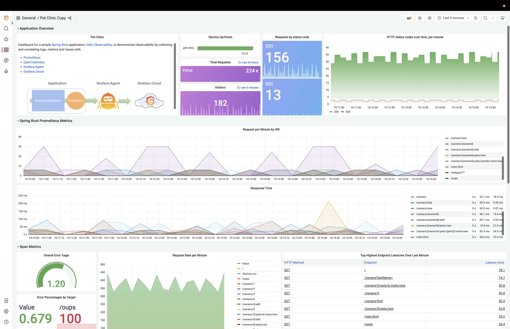
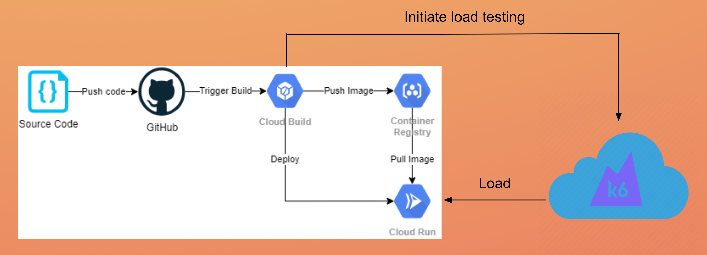

# Spring PetClinic Sample Application - Grafana Obaservability
 Spring Petclinic app to demo Grafana o11y - logs, metrics, traces

## Understanding the Spring Petclinic application with a few diagrams
<a href="https://speakerdeck.com/michaelisvy/spring-petclinic-sample-application">See the presentation here</a>

# Spring PetClinic
Simple [Spring Boot](https://spring.io/guides/gs/spring-boot) application to demonstrate collecting and correlating logs, metrics and traces with [Prometheus](https://prometheus.io/), [OpenTelemetry](https://opentelemetry.io/), and [Grafana Cloud](https://grafana.com/products/cloud/). It is built using [Maven](https://spring.io/guides/gs/maven/). 

## Running everything locally

You can run the whole stack locally inside Docker, after building the application container. The whole stack contains:

- The Hello Observability application
- The simple load runner
- Prometheus for metrics
- Loki for logs
- Tempo for traces
- Grafana Agent to collect logs, metrics and traces
- Grafana

```
git clone adamquan/petclinic-grafana-o11y
cd petclinic-grafana-o11y
./mvnw package
docker build -t spring-petclinic .
cd local
docker-compose up
```
After all the containers are up, you can access the appliction here: http://localhost:8080/, and Grafana here: http://localhost:3000


and see something beautiful!
 



## Sending logs, metrics and traces to Grafana Cloud

You can also run the application locally, but send logs, metrics and traces to **Grafana Cloud**. You do need to configure the `cloud/config/agent.yaml` file with your Grafana Cloud information. Local components that starts inside Docker include:

- The Hello Observability application
- The simple load runner
- Grafana Agent to collect logs, metrics and traces

The architecture looks like: 



```
cd hello-observability/cloud
docker-compose up
```

Import the dashboard from the `dashboard.json` file,


Similary as you have done locally, import the dashboard and enjoy!

Here is a live version of the [dashboard](https://se-demo.grafana.net/d/UjJzQ1L7k/hello-observability?orgId=1)
